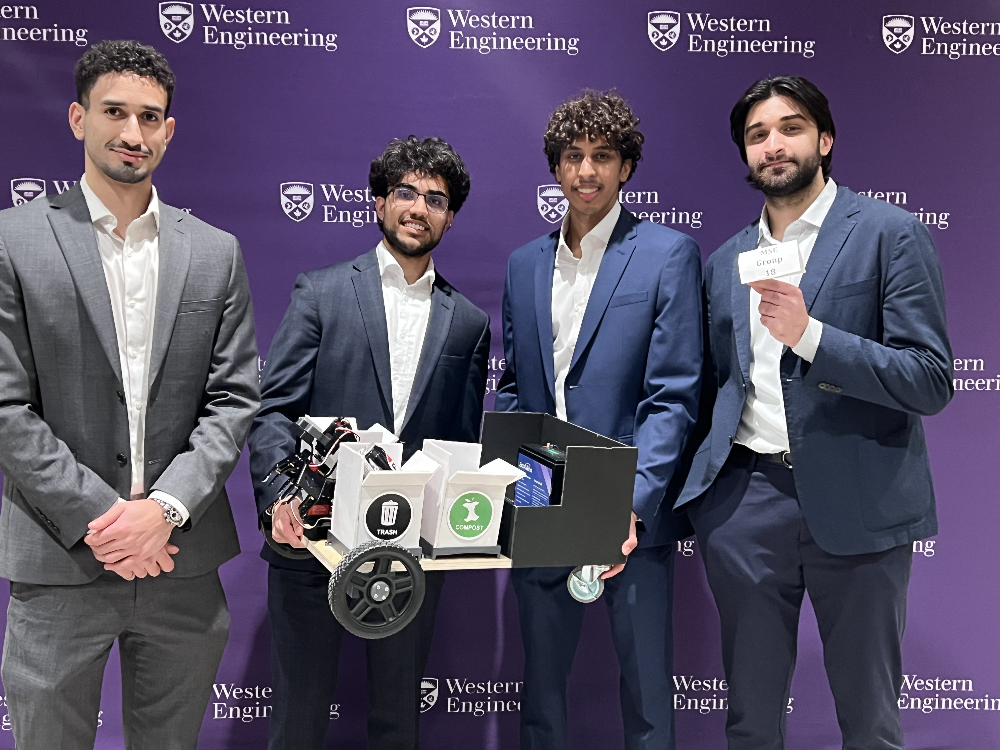

# RECLAIM — Autonomous Waste Collection & Sorting Robot

> **MSE 4499 Engineering Capstone — Western University, 2025–2026**
> **🏆 3rd Place at Capstone Showcase, March 26, 2026**

RECLAIM is an autonomous indoor robot designed to navigate post-event venues, detect waste on the ground using computer vision and depth sensing, pick it up with a 6-DOF robotic arm, classify it (recyclable / compost / landfill), and deposit it in the correct bin — fully autonomously.

---

## Demo

| | |
|---|---|
|  | **Western Engineering Capstone Showcase — March 26, 2026** <br><br> Team RECLAIM with the robot at the showcase. The arm, differential drive base, and sorting bins (Trash / Compost) are visible. <br><br> 🏆 **3rd Place overall** |

### Robot in Action

*Click any thumbnail to watch*

| | | |
|---|---|---|
| [](https://youtube.com/shorts/9OcipLxrr-4) | [](https://youtube.com/shorts/SzoJCjD1EAE) | [](https://youtube.com/shorts/PJnd1PVIbLY) |

---

## System Overview

```
┌─────────────────────────────────────────────────────────┐
│                     RECLAIM Robot                       │
│                                                         │
│  ┌──────────┐    ┌──────────┐    ┌────────────────┐    │
│  │ RPLIDAR  │    │ OAK-D    │    │  Jetson Orin   │    │
│  │  A1M8    │───▶│  Lite    │───▶│  NX (MIC-711)  │    │
│  │  LiDAR   │    │  Camera  │    │   ROS2 Humble  │    │
│  └──────────┘    └──────────┘    └───────┬────────┘    │
│                                          │              │
│                                   ┌──────▼──────┐       │
│                                   │  Teensy 4.1 │       │
│                                   │  micro-ROS  │       │
│                                   └──────┬──────┘       │
│                              ┌───────────┼───────────┐  │
│                         ┌────▼────┐ ┌────▼────┐  ┌───▼──┐│
│                         │ MD13C R3 L │ │BTS7960 R│  │Servos││
│                         │ Motor   │ │ Motor   │  │ 6DOF ││
│                         └─────────┘ └─────────┘  └──────┘│
└─────────────────────────────────────────────────────────┘
```

---

## Subsystems

### 🔋 Electrical & Power Distribution
- **Prototype:** 12.8V LiFePO4 battery → DC disconnect → 6-way fuse block → XINGYHENG buck converter (12V→6.8V servo bus) → Wago lever-nut distribution to 6 servo motors. 10,000µF bulk capacitance on servo rail.
- **Product PCB Design:** 24V input → dual-stage buck regulation (LM5116 24V→12V, TPS5430 12V→5V) → AMS1117 LDO (5V→3.3V) → E-stop relay circuit (G5LE-1A relay, IRLZ44N MOSFET gate driver, flyback diode protection) → fused distribution to all subsystems
- **KiCad Schematics:** Full hierarchical schematic design across 7 sheets (3 prototype + 4 product) with custom symbol libraries, netlist, and BOM documentation
- **Power Monitoring:** 3× INA226 current/power monitors on motor bus, compute rail, and servo rail

### 🚗 Locomotion & Motor Control
- **Differential drive** on two JGB37-520 12V motors with Hall-effect quadrature encoders
- **Mixed motor driver setup:** Cytron MD13C R3 (left) + BTS7960 (right), driven by Teensy 4.1 via PWM/DIR
- **PI velocity controller** on Teensy with per-wheel gains derived from step-response system identification
- Anti-windup, feedforward, low-pass filtering, ramp rate limiting (0.5 m/s²), static friction compensation
- **Calibrated odometry:** 1% distance error (50.5cm for 50cm target), 2-3° heading error on 360° spin
- Heading-hold controller in software bridge (Kp=2.0) to counteract castor drag

### 🗺️ Navigation & SLAM
- **SLAM Toolbox** for real-time mapping and localization using RPLIDAR A1M8
- **Nav2** autonomous navigation stack deployed on Jetson Orin NX via RoboStack/conda
- **`teensy_bridge.py`** ROS2 node: `/cmd_vel` → serial motor commands, encoder ticks → `/odom` publishing
- **Visual servoing pipeline** (`waste_tracker.py`): `SCAN → TURN_TO_TARGET → APPROACH → ALIGN` state machine
  - PID angular controller with Kalman filter (4-state: cx, cy, vx, vy) for smooth target tracking
  - EMA filtering, angular deadband, ramp limiting, coast-on-lost-detection
  - 5-frame detection confirmation before committing to a target
  - Speed proportional to distance: ramps from 0.12 to 0.04 m/s on approach

### 👁️ Perception
- **YOLOv8n** fine-tuned for waste classification (10-15 item classes → 3 bin categories)
- **OAK-D Lite** stereo depth camera via DepthAI v3 API — 640×480 @ 30.7 FPS
- Depth filtering (<1500mm), bbox area filtering (0.5–25% of frame), bottom-of-frame priority
- Detection published to `/perception/detections` as `DetectionArray` with 3D position

### 🦾 Robotic Arm
- 6-DOF arm with mixed servo types: DS3218 (270°, 21.5kg·cm), DS3235 (270°, 32kg·cm), MG996R
- LewanSoul mechanical claw gripper (0–193.5mm opening, 700g clamp force)
- Servo PWM controlled directly from Teensy 4.1 pins 10–15
- 6.8V servo bus with 10,000µF bulk capacitor to prevent brownout on simultaneous movement

---

## Hardware

| Component | Model | Notes |
|-----------|-------|-------|
| Compute | Advantech MIC-711 (Jetson Orin NX) | ROS2 Humble via RoboStack/conda |
| Microcontroller | Teensy 4.1 | micro-ROS, USB serial @ 115200 baud |
| Camera | OAK-D Lite | DepthAI v3, USB 3.0, stereo depth |
| LiDAR | RPLIDAR A1M8 | 360°, 0.15–12m range |
| Drive Motors | 2× JGB37-520 12V 37RPM | Hall-effect quadrature encoders |
| Motor Drivers | Cytron MD13C R3 + BTS7960 | PWM+DIR / LPWM+RPWM |
| Arm Servos | DS3218, DS3235, MG996R | 6-DOF, mixed torque ratings |
| Battery | ZapLitho 12.8V 22Ah LiFePO4 | 30A BMS |
| Network | GL.iNet Mango router | WiFi bridge for SSH/rsync |

---

## Software Stack

| Layer | Technology |
|-------|-----------|
| OS | Ubuntu 20.04 (JetPack 5.x) |
| Robot Framework | ROS2 Humble (via RoboStack/conda) |
| SLAM | SLAM Toolbox |
| Navigation | Nav2 |
| Firmware | PlatformIO / micro-ROS (Teensy 4.1) |
| Perception | YOLOv8n + DepthAI v3 |
| Visualization | Foxglove Studio |
| Schematic Design | KiCad 10 |

---

## Repository Structure

```
reclaim_ws/
├── src/
│   ├── reclaim_perception/       # OAK-D pipeline, YOLO inference, detection publisher
│   ├── reclaim_navigation/       # SLAM Toolbox, Nav2, LiDAR configs
│   ├── reclaim_control/          # Teensy firmware (PlatformIO) + micro-ROS
│   │   └── firmware/             # Motor control, encoder, servo firmware
│   ├── reclaim_bringup/          # State machine, system integration, top-level launch
│   └── reclaim_interfaces/       # Custom ROS2 msg/srv/action definitions
├── docs/
│   ├── product_pcb_electrical/   # Product KiCad schematic (4 sheets, STM32-based)
│   ├── prototype_pcb_electrical/ # Prototype KiCad schematic (3 sheets, Teensy-based)
│   ├── schematic_images/         # Exported PDFs + wiring guide
│   ├── Teensy.md                 # Pin map, flash procedure, serial comms
│   └── Perception_Strategy.md    # YOLO training strategy, OAK-D depth pipeline
├── matlab_sims/                  # Motor modelling, Bode plots, control tuning
├── sync.sh                       # rsync wrapper: edit locally → deploy to MIC-711
└── setup.sh                      # Environment setup script
```

---

## Quick Start (on MIC-711)

```bash
# Activate ROS2 environment
conda activate ros_env

# Sync from Mac (run on Mac)
./sync.sh reclaim_control --build

# Launch full system
source install/setup.bash
ros2 launch reclaim_bringup full_system.launch.py
```

---

## My Contributions (Shady Siam)

- **Electrical system design** — full power distribution for prototype and product PCB, including multi-stage buck regulation, E-stop relay circuit, servo bus design, and component selection
- **KiCad schematics** — 7-sheet hierarchical schematic design (product + prototype) with custom symbol libraries
- **Motor control firmware** — PI velocity controller on Teensy 4.1 with system identification, odometry calibration, and heading hold
- **ROS2 navigation stack** — SLAM Toolbox, Nav2, odometry bridge, visual servoing pipeline with Kalman-filtered target tracking
- **Systems integration** — full software environment setup on Jetson Orin NX, SSH/rsync workflow, Foxglove visualization

---

## Team

| Name | Role |
|------|------|
| Shady Siam | Electrical systems, power distribution, locomotion, navigation & SLAM |
| Issa Ahmed | AI stack, perception (YOLOv8n), autonomous operation |
| Dev Panara | Robotic arm, mechanical design, CAD |
| Abdul Kassem | Product locomotion (motor selection, torque analysis), commercialization strategy |

---

*Western University — MSE 4499 Engineering Capstone, 2025–2026*
